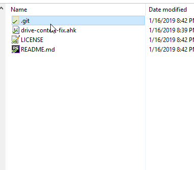

# Google Drive "Slow Right Click" Fix

This script dynamically enables/disables the Google Drive options in context menu when right-clicking in Windows Explorer. Easily toggled by simply holding down <kbd>shift</kbd> key. This is also typically known as the ["extended" right-click context menu](https://tortoisesvn.net/extendedcontextmenu.html).

Normally this isn't necessary and can configured to work this way by just adding an `Extended` registry key. However, since Google Drive (a.k.a. Backup & Sync) utilizes the `ContextMenuHandlers` registry key (see below) it cannot be hidden without doing it permanently or using a hack/workaround like this one. 

## Demo

Example of <kbd>right-click</kbd> (faster) and then <kbd>right-click</kbd> + <kbd>shift</kbd> (slower but includes Google Drive options when you *need* them).  

## Installation Instructions

Once running, you should see the AutoHotkey icon  running in your system tray in the bottom right corner of your screen.

#### 1. Configure Registry Permissions

* Press <kbd>Windows</kbd> + <kbd>R</kbd> to open the "Run" dialog.
* Type `regedit` and press enter.
* Find and right-click on each of the registry keys listed below and:
    * Select `Permissions...`
    * Select `Users` from the list
    * Enable `Full Control` permissions and click `Ok`.

	HKEY_CLASSES_ROOT\Directory\shellex\ContextMenuHandlers\GDContextMenu
	HKEY_CLASSES_ROOT\Directory\shellex\ContextMenuHandlers\DriveFS 28 or later
	HKEY_CLASSES_ROOT\*\shellex\ContextMenuHandlers\GDContextMenu
	HKEY_CLASSES_ROOT\*\shellex\ContextMenuHandlers\DriveFS 28 or later

#### 2. Run Script

**Quick:**

* Download [google-drive-context-fix.exe](https://github.com/patricknelson/google-drive-context-fix/raw/master/google-drive-context-fix.exe) to your computer.
* Double click `google-drive-context-fix.exe` to run the fix.

**From source:**

If you prefer to be safer and also have the ability to tinker with the code, you can also run from source. This only requires that you already have [AutoHotkey](http://www.autohotkey.com/) installed. 

* Download and install AutoHotkey from [http://www.autohotkey.com/](http://www.autohotkey.com/).
* Right click [google-drive-context-fix.ahk](https://github.com/patricknelson/google-drive-context-fix/raw/master/google-drive-context-fix.ahk) and select "Save link as..." to download.
* Double click `google-drive-context-fix.ahk` to run the fix. 

#### 3. Run at Startup (Optional)

To ensure this works every time you start your computer (recommended), you'll need to perform a few extra steps:

*  Press the Windows Key + R to open the "Run" dialog.
*  Type (or paste) the following and click OK. This should open the windows "Startup" folder: `shell:startup`
*  Right click the downloaded `.exe` or `.ahk` file and select "Copy".
*  Right click inside the "Startup" folder and select "Paste shortcut".
